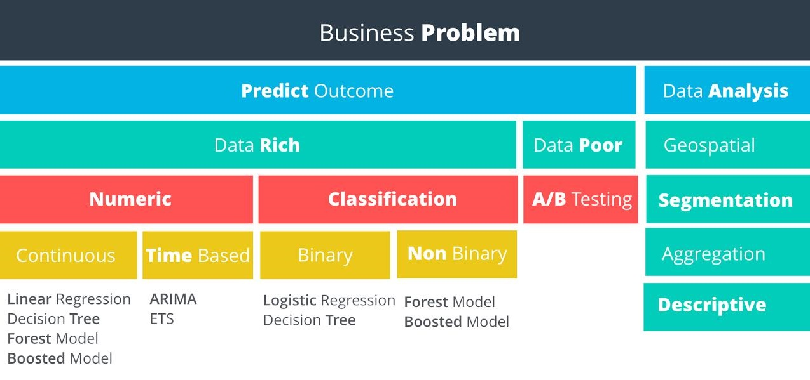
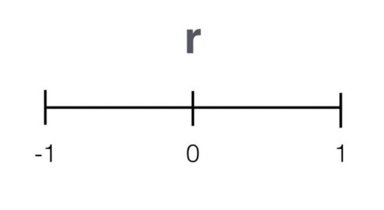
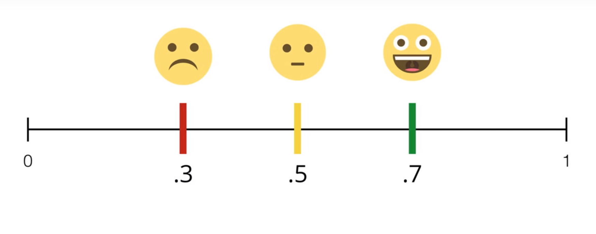

# 01 - Problem Solving with Analytics

## The Analytics Problem Solving Framework
Two key analytical concepts to understand any business situation and to choose the correct techniques to analyze the data.

### Cross Industry Standard Process for Data Mining (CRISP-DM)
A data mining process model that describes commonly used approaches that data mining experts use to tackle problems.

CRISP-DM Steps:

#### 1. Business Issue Understanding
Understanding the project objectives and requirements from a business perspective, and then converting this knowledge into a data mining problem definition, and a preliminary plan designed to achieve the objectives. A decision model, especially one built using the Decision Model and Notation standard can be used.

What decisions needs to be made?
What information is needed to inform those decisions?
What type of analysis can provide the information needed to inform those decisions?

#### 2. Data Understanding
Starts with an initial data collection and proceeds with activities in order to get familiar with the data, to identify data quality problems, to discover first insights into the data, or to detect interesting subsets to form hypotheses for hidden information.

What data is needed?
What data is available?
What are the important characteristics of the data?

#### 3. Data Preparation
Covers all activities to construct the final dataset (data that will be fed into the modeling tool(s)) from the initial raw data. Data preparation tasks are likely to be performed multiple times, and not in any prescribed order. Tasks include table, record, and attribute selection as well as transformation and cleaning of data for modeling tools.

Common Steps Used in Data Preparation
Gathering: When gathering data - you may need to collect data from multiple sources within your organization.
Cleansing: The data set you are working with may have issues that you want to resolve prior to your analysis. This can be in the form of incorrect or missing data.
Formatting: You may need to format the data by changing the way a date field appears, renaming a field, or even rotating the data, similar to using a pivot table.
Blending: You may want to blend, or combine, your data with other datasets to enrich it with additional variables, similar to using the vlookup function in Excel.
Sampling: Lastly, you may want to sample the dataset and work with a more manageable number of records.

#### 4. Analysis/Modeling
In this phase, various modeling techniques are selected and applied, and their parameters are calibrated to optimal values. Typically, there are several techniques for the same data mining problem type. Some techniques have specific requirements on the form of data. Therefore, stepping back to the data preparation phase is often needed.

Determine what methodology to use to solve the problem
Determine the important factors or variables that will help solve the problem
Build a model to solve the problem
Run the model and move to the validation phase

#### 5. Validation
At this stage in the project you have built a model (or models) that appears to have high quality, from a data analysis perspective. Before proceeding to final deployment of the model, it is important to more thoroughly evaluate the model, and review the steps executed to construct the model, to be certain it properly achieves the business objectives. A key objective is to determine if there is some important business issue that has not been sufficiently considered. At the end of this phase, a decision on the use of the data mining results should be reached.

Important Steps
Observe the key results on the model
Ensure the results make sense within the content of the business problem
Determine whether to proceed to the next step or return to a previous phase
Repeat as many times as necessary

#### 6. Presentation/Visualization
Creation of the model is generally not the end of the project. Even if the purpose of the model is to increase knowledge of the data, the knowledge gained will need to be organized and presented in a way that is useful to the customer. Depending on the requirements, the deployment phase can be as simple as generating a report or as complex as implementing a repeatable data scoring (e.g. segment allocation) or data mining process. In many cases it will be the customer, not the data analyst, who will carry out the deployment steps. Even if the analyst deploys the model it is important for the customer to understand up front the actions which will need to be carried out in order to actually make use of the created models.

Key Considerations
Determine the best method of presenting insights based on the analysis
Determine the best method of presenting insights based on the audience
Make sure the amount of information shared is not overwhelming
Use the results to tell a story to the audience
For more complex analyses, you may want to walk the audience through the analytical problem solving process
Always reference the data sources used
Make sure your analysis supports the decisions that need to be made

## Selecting an Analytical Methodology
The Predictive Methodology Map is a guide to determine the appropriate analytical technique(s) to solve a particular business question or problem.

The map outlines two main scenarios for a business problem:

1. Data analysis
- Refers to the more standard approaches of blending together data and reporting on trends and statistics and helps answer business questions that involve understanding more about the dataset such as "On average, how many people order coffee and a donut per transaction in my store in any given week?"

2. Predictive analysis
- Help businesses predict future behavior based on existing data such as "Given the average coffee order, how much coffee can I expect to sell next week if I were to add a new brand of coffee?"

### Step 1: Determine if the business problem involves predicting an outcome or not? Predictive means uses existing data to predict a future outcome.

#### Non-Predictive Analysis Types:
1. Geospatial
2. Segmentation
3. Aggregation
4. Descriptive

#### Geospatial Analysis
- Uses location based data to help drive your conclusions
Examples:
- identifying customers by a geographic region
- calculating the distance store locations
- creating a trade area based upon customer locations.

#### Segmentation Analysis
- the process of grouping data together.
Groups can be simple, such as:
- customers who have purchased different items
- identify stores that are similar based upon the demographics of their customers.

#### Aggregation Analysis
- calculating a value across a group or dimension and is commonly used in data analysis.
Examples:
- aggregate sales data for a salesperson by month - adding all of the sales closed for each month
- aggregate across dimensions, such as sales by month per sales territory.

#### Descriptive Analysis
- provides simple summaries of a data sample
Examples:
- calculating average GPA for applicants to a school
- calculating the batting average of a professional baseball player

Some of the commonly used descriptive statistics are Mean, Median, Mode, Standard Deviation, and Interquartile range.

### Step 2: If it is to predict Outcome, investigate the data we have. Is this a data rich, or data poor problem? If we have past data on the variable we’re trying to predict, then we are data rich. Otherwise, we are data poor.

#### A/B Tests
If there is not sufficient usable data to solve the problem, then we need to set up an experiment to help us get the data we need. An experiment in a business context is usually referred to as an A/B Test.

### Step 3: If we have sufficient data, next is to look at the outcome we are trying to predict and determine if it's a numeric outcome or non numeric outcome.

#### Regression Models
Numeric outcomes are those where the outcome is simply a number. Predicting the demand for electricity or the hourly temperature are both numeric outcomes. Models predicting numeric data are called regression models.

### Step 4a: If numeric, should a continuous or time-based model be used?

#### Types of Numeric Variables
The three most common types of numeric variables are continuous, time-based, and count.

#### Continuous
A continuous variable is one that can take on all values in a range. For instance your height can be measured down to many decimal places. We do not grow in even inch intervals.

#### Time-Based
A time-based numeric variable is one where you are trying to predict what will happen over time. This is often related to forecasting.

#### Count
Count variables are numbers that are discrete, positive integers. They’re called count numbers because they’re used to analyze variables that you can count. As modeling these type of variables is not common in business, we won’t be covering this topic in this course.

### Step 4b: If classification, should a binary or non-binary model be used?

#### Non-Numeric Variables
A non-numeric variable is often called categorical, because the values of the variable take on a discrete number of possible values or categories. Examples include whether an electronic device will fail before 1000 hours or not; whether a customer will pay on-time, pay late, or default on a payment, or whether a store is classified as large, medium or small.

#### Classification Models: Binary and Non-Binary
When modeling categorical variables, the number of possible outcomes is an important factor.
Binary: If there are only two possible categorical outcomes, such as Yes or No, or True or False
Non-Binary: If there are more than two possible categorical outcomes, such as small, medium, or large, or pay on-time, pay late, or default on a payment

## Linear Regression

Imagine we have the data displayed in the scatter plot. It appears that we have a linear relationship between the number of employees and the number of tickets. The relationship appears to be linear since it seems like we can draw a straight line through the data.

If we know the equation of the line, we can predict values using the equation:

### y = mx + b
- Y = Target Variable
- X = Predictor Variable
- m = Slope of the line
- b = Y-intercept

#### Target Variable
- the variable we are trying to understand and predict. It is also referred to as the dependent variable. In our example, we are trying to predict Y, or the average number of tickets.

#### Predictor Variable
- used to try to predict the target variable and are also known as independent variables. In the example there is just one predictor variable, X, or the number of employees. It is used to predict the number of tickets based.

### Steps for Calculating the Linear Regression

Step 1: Use the Slope function SLOPE(data_y, data_x). Include the values for the target variable in the first field called 'data_y' and the values for the predictor variable in the second field called 'data_x'.
Step 2: Use the Intercept function INTERCEPT(data_y, data_x) using the same values for the same fields.
Now, we know the equation of our line:

### Validation
Now that we’ve performed the analysis and run the Linear Regression Model, we need to validate the results of the model. In other words, is there a way to measure how good the model is? Or in this case, is the linear expression we calculated a good fit of our data?

Step 1: Correlation
Using the correlation function CORREL(data_y, data_x), we can calculate the correlation between the target and predictor variable. This value is often referred to as r. The range of r is from -1 to +1. The closer r is to plus or minus 1, the higher the correlation between x and y.

Step 2: Calculate r-squared
While a strong correlation is good, we really want to know how well the data fits our line. Fortunately, we can get a sense of how good the formula is at approximating the data by calculating the coefficient of determination, or r-squared. R-squared is a coefficient between 0 and 1. R-squared is interpreted as the percent of variance in observations that is explained by the model, or the explanatory power of the model. An R-squared value close to 1 would mean that nearly all variance in the target variable is explained by the model. An R-squared value close to 0 would mean that nearly none of the variance in the target variable is explained by the model.

- r squared value of 0.5 or greater is usually pretty good
- r squared value less than 0.3 is generally agreed to be not useful

Caution about interpreting R-squared
How you interpret R-squared depends heavily on the problem you're trying to model and the data you use. For tough problems, a very low R-squared may be acceptable. Also, a high R-squared may result from a poor model. However, in general, the higher the R-squared the better, especially as you add and remove predictor variables to determine the strongest predictive model. To read more about interpreting R-squared, see here.

## Multiple Linear Regression

Y = β 0 + β1X1 + β2 X 2

The X's represent the values for each variable. These come directly from the data. The β's come from the linear regression model. β 0 is the intercept. The other β's represent the relationship between the predictor variable X and the target variable Y.

Transforming Categorical Variables

You will then learn how to create linear regression models to help you predict numerical data such as sales. You'll dive deep into these concepts:

1. Linear relationship
2. Multiple-R squared and p-values
3. Significant coefficients
4. Modeling categorical variables
