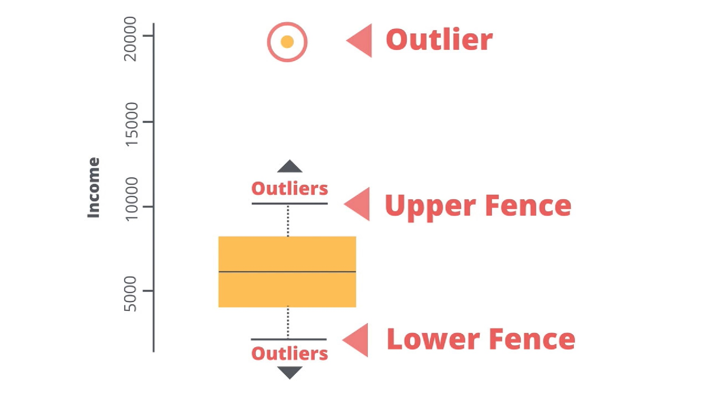

# 02 - Data Wrangling

##  1. Understanding Data
- What are the various types of data?
- Why is formatting important?

### Sources of Data
1. Transactional: like what's recorded at the supermarket for every purchase.
2. Devices: captured from devices we use like our TV, cable boxes, or cellphones
3. Collected: data like weather, census, or flight data.

Challenge: how you can use all the data available to make your analyses as rich and powerful as possible

### Categories of Data
1. Structured
Structured data are data with a high degree of organization. They are typically organized into columns and rows like in a spreadsheet. Sometimes columns are also called fields and rows are referred to as records and these terms may end up being used interchangeably throughout the course. Each column represents a variable and each row represents a record of data. Structured data is often stored in databases or files such as spreadsheets and it is usually easily accessible and most importantly, it’s easy to use.

2. Unstructured
Unstructured data can have no structure to it at all. Since the data isn’t organized into a typical columns and rows format, it can be time-consuming to work with as you have to pull what you want out of it. Some examples of this type of data are a resume, a tweet or a contract document.

3. Semi-Structure
Semi-structured data is data that has some structure to it but still requires some work to put it into a structured format of columns and rows. This could be a computer system log file that requires parsing and manipulating to put into a format that makes the data easier to analyze.

### Data Sources
1. Computer files: created from applications like MS Excel or Access, from predictive software like SAS or SPSS.
2. Databases
3. Web-based sources

### Importance of Data Types
1. Doing calculations across multiple fields: assumes that we're working with numeric fields so both of the fields need to be number types.
2. Blending data sets: field or fields we're joining on to be the same data type

### Common Field Types
1. Strings: are any combination of characters, alpha-numeric including symbols. Some examples can be an address field, a state code, an open-ended survey response or a product description.

2. Numeric: are numbers which can be whole numbers such as integers or numbers with decimal places. Some examples are sales in dollars, population in a trade area around a store or the age of a person.

3. Date/Time: can contain a specific date or a combination of both date and time. This data can be really handy for calculating the number of minutes between a caller reporting a problem and its resolution.

4. Boolean: sometimes also called a Logical type and is a conditional flag representing either true or false.

5. Special Objects: can be objects such as images, maps, report objects, and sound files to name a few examples.

## 2. Data Issues
- Problems we may encounter when working with data
- Dirty data, missing values, outliers

### Dirty Data
Data that contains some kind of errors in them, or are in a format that's unfriendly or unusable.

Examples:
- Not parsed correctly: last name and first name appear all in one field instead of multiple fields.
- Extra Characters: extra characters in data fields that make it difficult to use the data readily.
- Misspelled Entries: typos which can easily happen when typing data in manually.
- Duplicate Data Records: happen because of multiple data entries for the same information.
- Incorrect Data: like dates that are from January 1, 1900. This can happen when a user is working with a system that requires a value but none is available at the time.
- Unexpected Pattern: data that does not fit with the expected pattern. Example not email addresses are in the proper format that ends with ".com".

### Dirty Data - Parsing
Parsing is done when dividing data into parts based on some kind of delimiter.

Example: Comma Separated Values file (CSV) data is delimited with commas.

### Dirty Data - Extra Characters
Extra characters could be anything, like currency symbols or number signs.

Example: Quotation marks in Name, extra letter after postal code & currency sign before value

### Missing Data

1. Empty fields: data comes from a CSV file
2. Null value: data comes from a database
3. N/A value: typically means not available in programs that we use

### Missing Data - Why care about missing data?
1. Some statistical algorithms won't work.
2. Can add BIAS to a model. Which means either over or underestimate of that specific field or parameter.

### Missing Data - Dealing with Missing Databases
1. Deleting Missing Data
Deleting missing data is often the default method because of it's simplicity. No decisions that need to be made that might confuse the data. You just get rid of records where there are missing values.

However, you should make sure that deleting missing data doesn't have adverse effects on your analysis. For example, if a particular demographic tended to leave a response blank in a survey, then removing records with blank entries will mean that a part of the population is underrepresented.

One of the downsides is that eliminating missing data reduces the size of the dataset. As you'll see in your exercise removing records with missing values eliminates half of the observations in the dataset. This can be especially problematic when collecting the data is expensive, such as paying people for a survey.

2. Imputation
Imputation - The process of substituting values in the data where the values are missing. Replace missing values with predefined statistic, the mean, median, or mode.

Mean: Average value
Median: Midpoint in the data values
Mode: The most common of the data values

3. Multiple Imputation
Do imputation process multiple times using a method that will predict the missing values. Typically using regression then adding in some random error.

4. Full information Maximum Likelihood

### Missing Data - Factors to consider
1. Just how much data is really missing? [more than 95% or less than?]
2. How the missing data is distributed across the dataset? [majority of what's missing is in a smaller subset of the variables? Are they significant?]
3. The variable in question with the missing data is numeric or categorical? [unable to imputate vaerage for non-numeric value]

### Outliers
Outliers - Some values just don't seem to fit with the data set as a whole.
- Numeric: numbers that seem extreme, or way too large, or small compared to the other values in that field.
- Categorical: value that only appear once out of a large set of data.

### Outliers - What causes Outliers?
1. Incorrect data - System issues to bad data collection methods to just plain typos when entering data.
2. Abnormal but correct data -

### Outliers - Why do we care?
- this can mess with our answers to our business questions, whether we're tryng to explain why something happened a certain way or what may happen in the future.
- correct them if they're wrong or understand the exceptions that are real.

### Outliers - How to identify?
1. Box and Whisker - the value needs to be 1.5 times the Interquartile range beyond the first and third quartile to be considered an outlier.



To calculate the upper fence and the lower fence, here are the exact steps:
1. Calculate 1st quartile Q1 and 3rd quartile Q3 of the dataset. You can use the Excel function QUARTILE.INC or QUARTILE.EXC
2. Calculate the Interquartile Range: IQR = Q3 - Q1
3. Add 1.5 * IQR to Q3 to get the upper fence: Upper Fence = Q3 + 1.5 * IQR
4. Subtract 1.5 * IQR to Q1 to get the lower fence: Lower Fence = Q1 - 1.5 * IQR

2. Violin Plot

### Outliers - How to deal with it?
1. Remove insignificant outliers
2. Truncation: where we know that a certain value can only be  below a given maximum and yet a value is reported above that.

## 3. Data Formatting
Format our data so it is useful
Data is often not in the format we need

1. Transposing Data
Example combining sales value for multiple months into one field.

2. Aggregating Data
Example aggregate/summarize transactional data that list each product sold within one transaction as separate records.

3. Cross-tabulation / Crosstab
- Takes data within a field
- Summarize other data to the values within that field
- Create a matrix

## 4. Data Blending
- Blend data together from disparate datasets

### 1. Unions
- Allows you to take multiple datasets and deal with them as one.
- 2 datasets with the same fields.

### 2. Joins
- Joined sets with field in common.

### 3. Fuzzy Matching
- identifies non-identical duplicates of a dataset by specifying parameters to match on.
- join two data sets together where a regular join may fail.
- looks at words and calculate a closeness of match score, based on the similarity of these words.

### 4. Spatial Matching
- Most information has a location component to it. E.g. retail example, customers have locations where they live, locations for the stores they shop at, and locations for the distribution center from where stores get their products.
- Use spatial data from the customer or their point locations to see if they fall within or intersect the trade area.

## 7. Selecting Predictor Variables

1. Apply logic to get a list of possible variables

2. Make sure not using any duplicate variables that represents the exact same thing as another variable. Examples: (1) Homeowner vs Renter (2) Age Group vs Age (3) Runs vs Runs per game

3. Check correlations between our variables

### Correlation
Correlation: a measure of association between two variables
Correlation coefficient values range from -1 to 1
- 1: total positive correlation
- 0: no correlation
- -1: total negative correlation

### What may be a good quality predictor variable?
Is there inner correlation between or predictor variable?

### Correlation is measured using different types of association:
- Pearson
- Spearman
- Hoeffding

### Correlation between predictor variables
- Not much issues during building of a classification model
- Cause issues during the prediction time

## 9. Basic SQL

### SQL: Structured Query Language
- to utilize SQL to analyze data and answer business questions.

### Entity Relationship Diagram（ERD）
- A common way to view data in a database.
- help to visualize the data you are analyzing

### Why SQL?
- SQL is easy to understand.
- Traditional databases allow us to access data directly.
- Traditional databases allow us to audit and replicate our data.
- SQL is a great tool for analyzing multiple tables at once.
- SQL allows you to analyze more complex questions than dashboard tools like Google Analytics.

### Why Businesses Like Databases?
1. Data integrity is ensured - only the data you want entered is entered, and only certain users are able to enter data into the database.

2. Data can be accessed quickly - SQL allows you to obtain results very quickly from the data stored in a database. Code can be optimized to quickly pull results.

3. Data is easily shared - multiple individuals can access data stored in a database, and the data is the same for all users allowing for consistent results for anyone with access to your database.

### How databases store data?
1. Data in databases is stored in tables that can be thought of just like Excel spreadsheets.
For the most part, you can think of a database as a bunch of Excel spreadsheets. Each spreadsheet has rows and columns. Where each row holds data on a transaction, a person, a company, etc., while each column holds data pertaining to a particular aspect of one of the rows you care about like a name, location, a unique id, etc.

2. All the data in the same column must match in terms of data type.
An entire column is considered quantitative, discrete, or as some sort of string. This means if you have one row with a string in a particular column, the entire column might change to a text data type. This can be very bad if you want to do math with this column!

3. Consistent column types are one of the main reasons working with databases is fast.
Often databases hold a LOT of data. So, knowing that the columns are all of the same type of data means that obtaining data from a database can still be fast.

### Statements
- Tell the database what you'd like to do with the data.

### Types of statements
- A few statements include:

1. CREATE TABLE is a statement that creates a new table in a database.
2. DROP TABLE is a statement that removes a table in a database.
3. SELECT allows you to read data and display it. This is called a query.

`SELECT ... FROM ....`

*SELECT* indicates which column(s) you want to be given the data for.

*FROM* specifies from which table(s) you want to select the columns. Notice the columns need to exist in this table.

If you want to be provided with the data from all columns in the table, you use `*`, like so:

`SELECT * FROM orders`

*LIMIT statement*: useful when you want to see just the first few rows of a table. This can be much faster for loading than if we load the entire dataset.

```
SELECT *
FROM orders
LIMIT 10;
```

*ORDER BY statement*: allows us to sort our results using the data in any column
- The ORDER BY statement always comes in a query after the SELECT and FROM statements, but before the LIMIT statement.
- can order by more than one column at a time, sorting occurs using the leftmost column in your list first, then the next column from the left, and so on.

```
SELECT id, account_id, total_amt_usd
FROM orders
ORDER BY account_id, total_amt_usd DESC
LIMIT 5;
```

*WHERE statement*: display subsets of tables based on conditions that must be met.

Common symbols used in WHERE statements include:
```> (greater than)
< (less than)
>= (greater than or equal to)
<= (less than or equal to)
= (equal to)
!= (not equal to)
```

- The WHERE statement always comes in a query after the SELECT and FROM statements, but before the ORDER BY and LIMIT statement.
- can also be used with non-numeric data.


## 10. SQL Join

## 11. SQL Aggregations

## 12. SQL Subqueries & Temporary Tables

## 13. SQL Data Cleaning

## 14. [Advanced] SQL Window Functions

## 15. [Advanced] SQL Advanced JOINs & Performance Tuning
