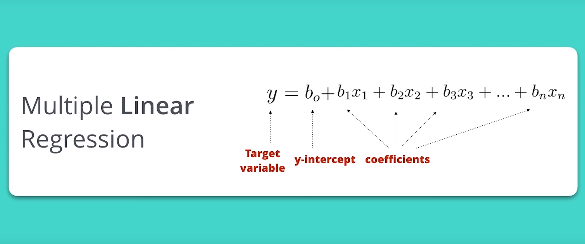
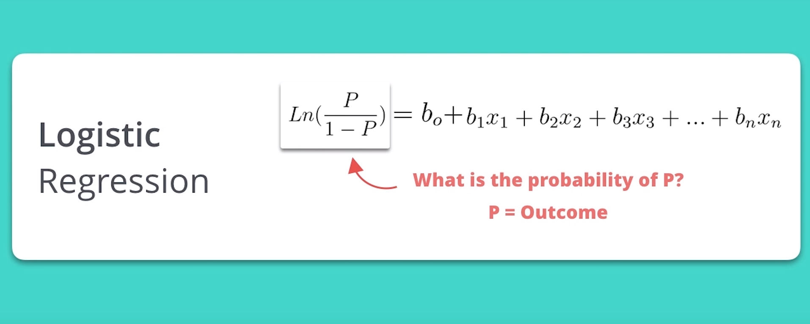
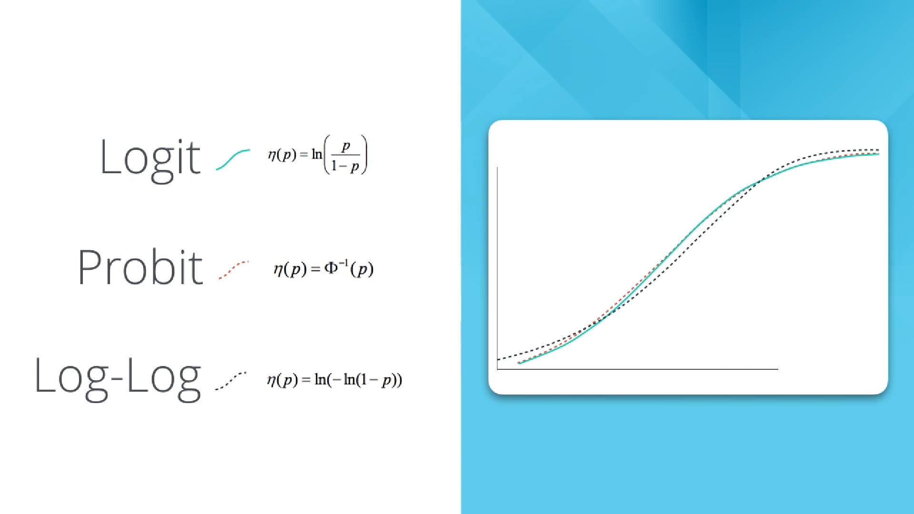
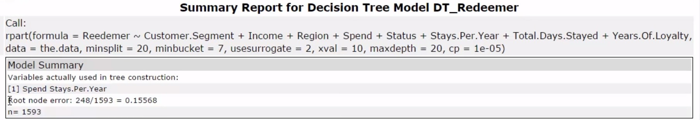

# 04 - Classification Models

## Classification Problems
- New class of predictive models: classification models
- These models help identify what group a data point belong to. Example, if we were to decide whether a person qualifies for a loan or not, we need to look at the person's loan application and classify whether the person should be in the approve loan group or the not approve loan group.

### Classification Models Types:

- Logistic Regression
- Decision Trees
- Random Forests
- Boosted Models

### Classification Problems Types

1. Business problems
- Email as spam or inbox?
- Customer going to renew contract or not?

2. Scientific problems
- What land cover type is a pixel from a Satellite image?
- Does soy bean have a disease or not?

3. Real life problems
- What color shirt looks best on me?
- What type of transportation will employee use to go to work?

#### Classification Grouping

1. Binary: equal 2 groups
- One that has a yes or no, a 1 or a 0 or a true or false type of value associated with it.

2. Non-binary: more than 2 groups
- the ones that are categorical meaning there are values that take on names, or labels such as red, green, blue, or small, medium and large.

## Binary Classification Problems

### Building out binary classification models
1. Logistic Regression
- Most basic forms of regression modeling
- Formula is very similar to that of a linear regression

#### Logistic regression algorithms
- Logit transformation equation
  - Focus on concepts
  - How to apply them
  - How to interpret results

- Probit transformation equation
- Log-Log transformation

#### Stepwise regression
- Way to automatically identify which variables are most important to the model and only include them in the model
- Focus on concepts
- Work for Logistic and linear regression
- A process where variable are added and/or removed until the best combination of variables is identified

#### Validating Models
- Validate model against an independent datasets
- What is the overall accuracy of the model?

2. Decision Trees
- Analyzes data as if they were a series of decisions.

#### Root Node Error
- A percentage of how many of the data points went to the incorrect terminal node (predicted incorrectly) when all of the data points are validated against themselves within the entire training set (the Estimation dataset).

#### Pruning Table
- Lists out the levels in the decision tree with their related error terms with cross-validation samples.

#### Confusion Matrix
- A matrix (or table) that lists out all of the possible prediction results when we validate our model against our validation set. This confusion matrix is one of the best methods to review the accuracy and precision of your model as well as to understand any model bias in classifying your data points.

#### Variable Importance Plot
- Indicate the importance of the variable

#### Scoring the model
- Means when we put a model into productions

## Binary Classification Problems

### 3 Types of Models:
#### 1. Decision Trees
- Decision Trees are prone to an error called over fitting, where the model fits the sample data too well, and as a result, does not predict future results as well as it should.
- A technique that helps to eliminate this issues is the Random Forest Model.

#### 2. Forest Models
- A Forest Model creates hundreds of trees, called an ensemble of decision trees
- Each tree is created by different randomly generated chunks of the original data.
It looks at the results as a whole to make a prediction.
- Each individual tree created still has overfitting issues, but when you look at the results as a whole, the overfitting gets averaged out by all of the other trees.

##### Things to look out for in Forest Model result:
a. Out of the bag error rate
- How well the model performed?
- How solid the model performs with estimate data?
- Similar to R-squared value

b. Confusion Matrix
- How well the model performed?
- Where error occurred in classifying data?

c. Percentage Error for Different Number of Trees graph
- Helps us see what the correct number of trees is to use, so we can avoid over computing.
- What we are looking for is the number of trees it takes to minimize the error of each of the items, so basically, where does it flatline?
- After we determine the ideal number of trees, we can change subsequent Forest Models and run our data with the smaller number of Decision Trees.

d. Variable Importance Plot
- Which predictor variables matter the most in relation to this model? This is very helpful in determining which variables are most associated with our data on and we can focus on for future analysis.

#### 3. Boosted Models
- Forest Models might give us a better estimate than decision trees, but they're computationally intensive.
- What we need is a model that can be both accurate AND fast. What we'll use to achieve this balance is known as the Boosted Model.

##### How the Boosted model avoids overfitting
- Instead of creating a bunch of random trees, the boosted model makes one tree.
- Algorithm performs an analysis on the errors of the tree to identify the biggest source of error.
- Changes the tree to reduce that error.
- Does the analysis again to find the next biggest error.
- Makes a change to reduce it.
- Does this over and over until it can’t make the tree any better and we have our finished Boosted Model.

##### Things to look out for in a boosted model report:
- Variable Importance Plot: Which variables deliver the most insight to the target variable?
- Number of Iterations Assessment Plot: How many trees are needed to create the optimal result?
