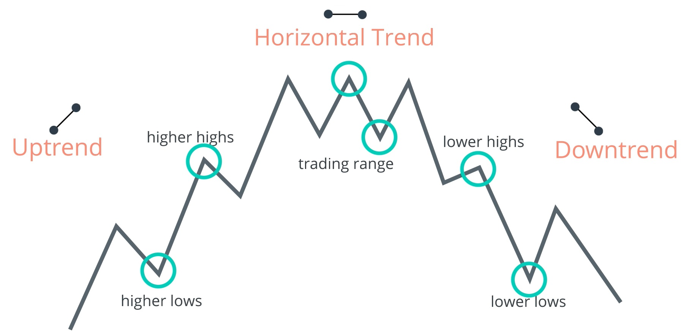
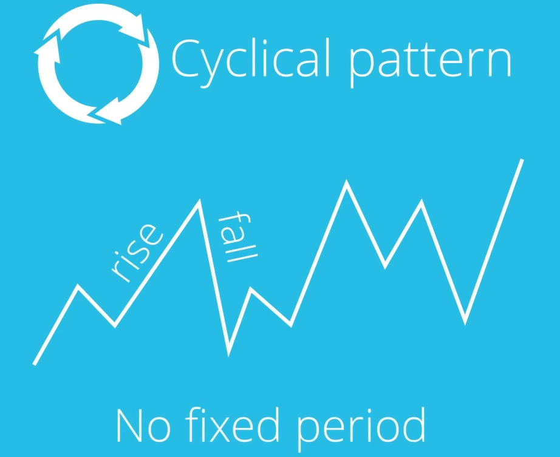
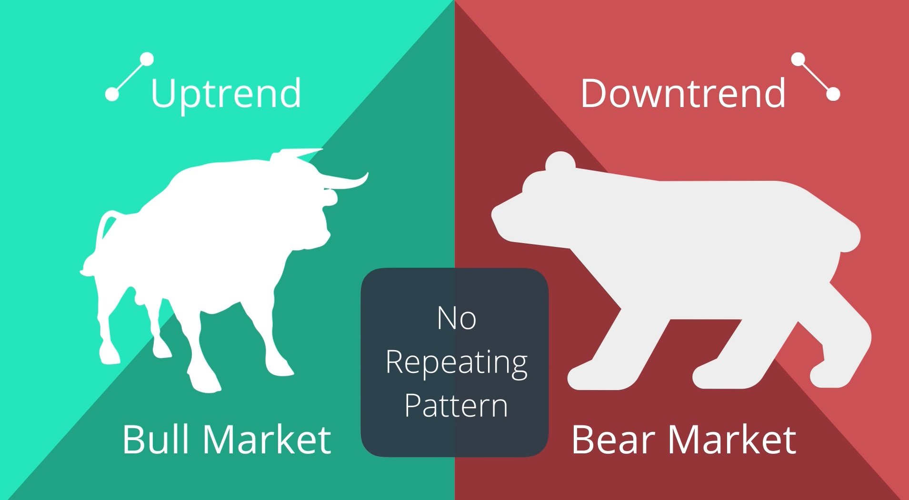
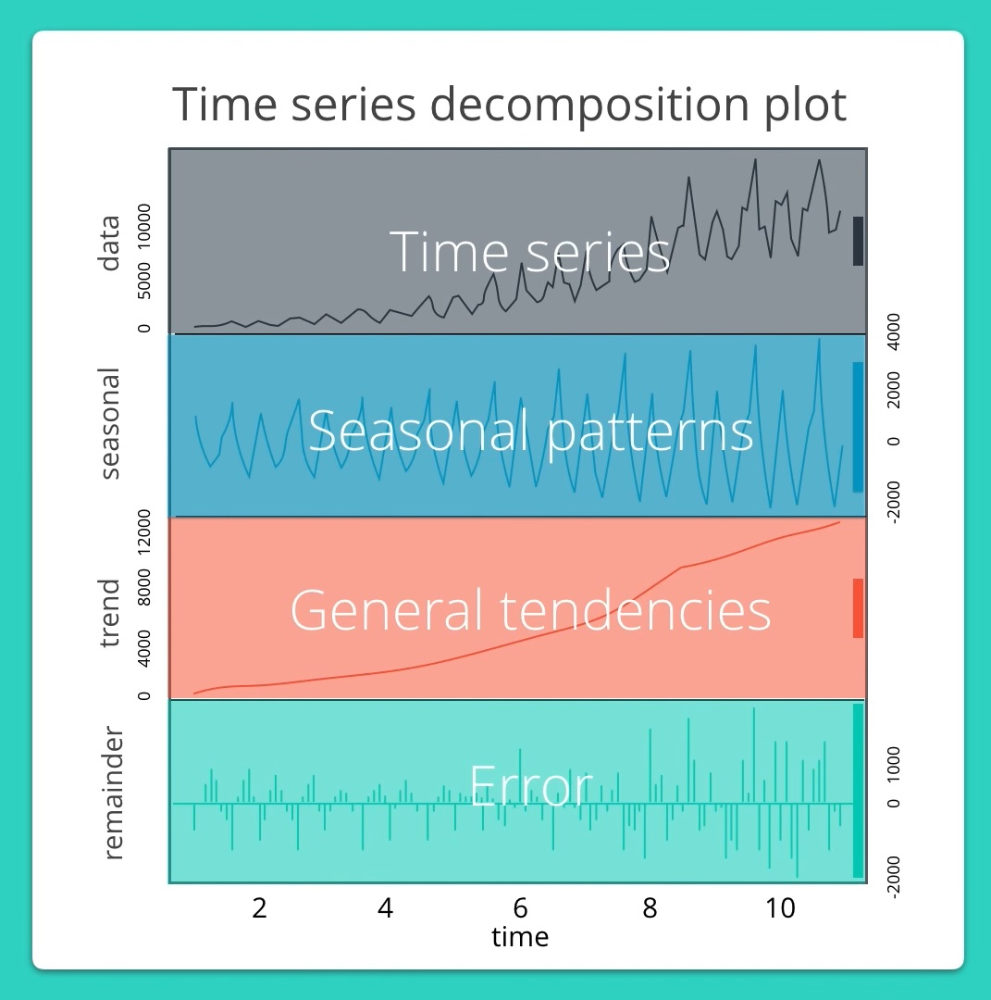
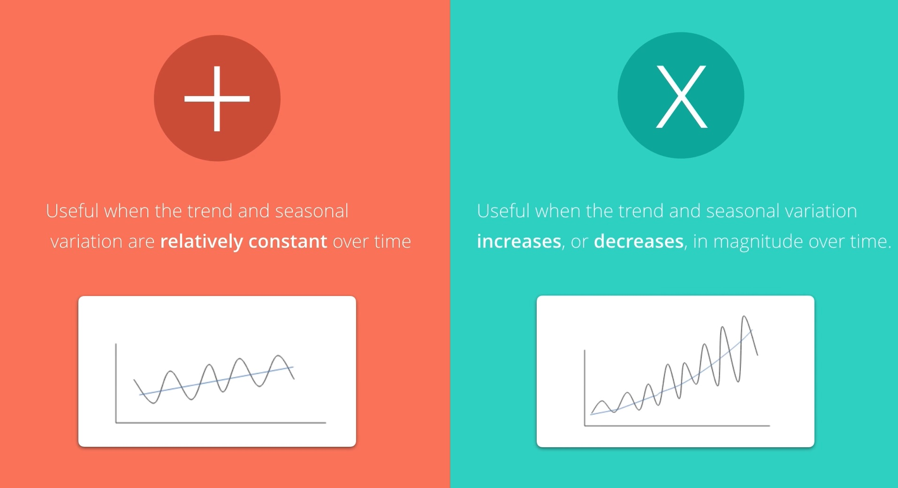
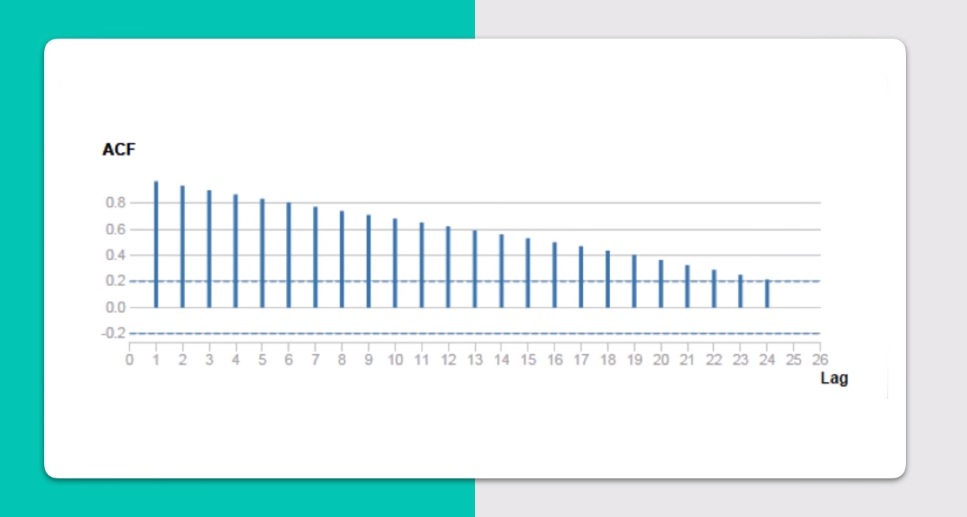

# 06 - Time Series Forecasting

## Fundamentals of Time Series Forecasting

### Time Series forecasting
- Time series forecasting is the use of a statistical model to predict future values based on past result.

### What kinds of variables can we forecast?
- Any variable that can be tracked and collected over time
- Example: Annual population data, company's daily stock price or quarterly sales figures

### Answer questions like:
- How do we define time?
- What are the trends?
- What are seasonal patterns?

### Order Matters
- There is a dependency on time and changing the order could change the meaning of the data.

### Objective
1. Identifying the patterns represented by the sequence of observations
2. Forecasting or predicting future values of the time series

### Time series is a sequence of data points with the following characteristics:
1. Covers a continuous time interval
2. Of sequential measurements across the interval
3. Equal spacing between every two consecutive measurements
4. Each time unit within the time interval has at most one data point

### Average Method
- The best predictor of what will happen tomorrow is the average of everything that has happened up until now.

### Naive Method
- If there is not enough data to create a predictive model, the Naive method can supplement forecasts for the near future.

### Trend
- A gradual shift or movement to relatively higher or lower values over a long period of time.

### Seasonal pattern / Seasonality
- A time series that exhibits a repeating pattern at fixed intervals of time within a one year period.

### Cyclical Pattern
- Exist when data exhibits rises and falls that are not of a fixed period.

### Cyclical vs Seasonal
- Cyclical: fluctuations are not of a fixed period. Avg length of cycles is longer than the length of the seasonal pattern. Magnitude of cycles tends to change more than the magnitude of season patterns.
- Seasonal: period is unchanging and associated with some aspect of the calendar.

## ETS Models (Exponential Smoothing)
- Use weighed averages of past observations, giving more weight to the most recent observation with weights gradually getting smaller as the observation gets older.

### E: Error, T: trend, S: Seasonality

### How do we determine how to apply the error, trend and seasonality terms of an ETS mode?

### Identifying Additive or Multiplicative terms

### Time Series Scenarios
- The possible time series (TS) scenarios can be recognized by asking the following questions:

#### TS has a trend?
- If yes, is the trend increasing linearly or exponentially?
- TS has seasonality?
- If yes, do the seasonal components increase in magnitude over time?

#### Scenarios
Therefore the scenarios could be:

- No-Trend, No-Seasonal
- No-Trend, Seasonal-Constant
- No-Trend, Seasonal-Increasing

- Trend-Linear,No-Seasonal
- Trend-Linear,Seasonal-Constant
- Trend-Linear,Seasonal-Increasing

- Trend-Exponential,No-Seasonal
- Trend-Exponential,Seasonal-Constant
- Trend-Exponential,Seasonal-Increasing

### ETS models
Four ETS models that can help forecast these possible time-series scenarios.

1. Simple Exponential Smoothing Method
2. Holt's Linear Trend Method
3. Exponential Trend Method
4. Holt-Winters Seasonal Method

### Simple Exponential Smoothing model
- Apply when time series does not have a trend line and does not have seasonality component.

### Holt's Linear Trend Method (Double Exponential Smoothing)
- Apply to any non seasonal data set.

### Exponential Trend Method:
- Apply to any non seasonal data set.

### Determine how to apply each component, Error (E), Trend (T), and Seasonality (S):

#### Error
- Looking at the error (labeled remainer in Alteryx) component in the time series decomposition plot in Alteryx, you see the following.

- The error has constant variance over time (peaks and valleys are about the same size), then you apply it additively.
- The error is growing or shrinking over time, then you would apply the error multiplicatively.
- In this case, it's a bit difficult to determine. Your first inclination was likely to apply it additively. However, if you let the ETS Tool decide (select Auto under the Model Type - Error Type), it selects multiplicative.

#### Trend
- Looking at the trend component in the time series decomposition plot in Alteryx, you see the following.

- If the trend is linear then you apply it additively.
- If the trend line grows or shrinks exponentially, then you would apply it multiplicatively.
- Again, your first inclination was likely to apply trend additively. However, if you let the ETS Tool decide (select Auto under the Model Type - Trend Type), it selects N or None.

- If you notice how the trend line changes direction towards the end of the period and goes back up, the ETS tool sees this line as a none trend line. Because the ETS tool is not able to determine whether the change is linear or exponential, in this scenario you would not apply trend in your ETS model.

#### Seasonality
Looking at the seasonal component in the time series decomposition plot in Alteryx, you see the following.

- Remember, if the peaks and valleys for seasonality are constant over time, you apply it additively. If the seasonality grows or shrinks overtime, then you would apply it multiplicatively. For seasonality, you don't have to consider if the change is linear or exponential, only if it is growing or shrinking over time. In this case, seasonality is growing slightly overtime (the peaks are increasing ever so slowly), so you would apply it multiplicatively. The ETS Tool's auto selection also indicates multiplicative seasonality.

## ARIMA Models (Autoregressive Integrated Moving Average)
Stands for A:Auto, R:Regressive, I: Integrated, M: Moving, A: average

### 2 Types of ARIMA models
1. Seasonal
2. Non Seasonal

### Autocorrelation
- How correlated a time series is with its past values

### Autocorrelation function plot (Correlogram)
- Shows a series correlated with itself like by x time units.
- used to see the correlation between the points up to, and including, our lag unit.

